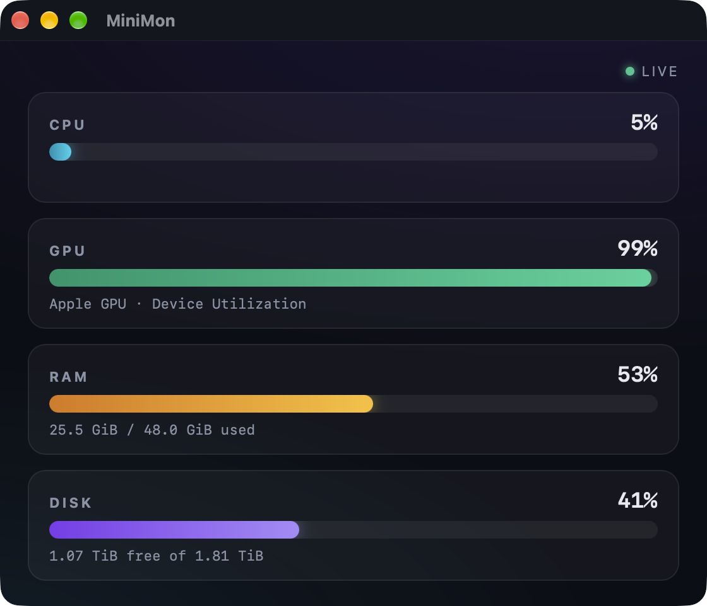

# MiniMon

A tiny real-time system monitor for Apple Silicon Macs, built with Rust + [Tauri v2](https://tauri.app).



Four glowing bar graphs — CPU, GPU, RAM and Disk — refreshed every second.

## Features

- **CPU** — total usage across all cores
- **GPU** — Apple GPU utilization, read straight from the IORegistry (no sudo, no external tools)
- **RAM** — used vs. total memory
- **Disk** — free space on your startup volume
- Dark, glassy UI with smooth animated bars
- Native and light: a ~7 MB Rust binary, no Electron

## Download

Grab the latest release from the [releases page](../../releases):

| File | Description |
| --- | --- |
| `MiniMon_0.1.0_aarch64.dmg` | Disk image (Apple Silicon) |
| `MiniMon_0.1.0_aarch64.app.zip` | App bundle (Apple Silicon) |

> **Note:** builds are unsigned, so macOS Gatekeeper may complain on first launch.
> Right-click the app → **Open**, or run `xattr -dr com.apple.quarantine MiniMon.app`.

## Development

Prerequisites: [Rust](https://rustup.rs), [Node.js](https://nodejs.org), and Xcode command line tools.

```sh
npm install
npm run dev      # run in development
npm run build    # release bundle in src-tauri/target/release/bundle/
```

## How it works

- CPU, RAM and disk come from the [`sysinfo`](https://crates.io/crates/sysinfo) crate.
- GPU utilization is parsed from `ioreg -r -c AGXAccelerator` — the `Device Utilization %`
  key of the Apple GPU's `PerformanceStatistics`, the same source menu-bar GPU monitors use.
- The frontend is plain HTML/CSS/JS; Rust exposes a single `get_stats` command that the
  UI polls once per second.

## Platform

macOS on Apple Silicon only (M-series). No cross-platform ambitions.

## License

MiniMon is licensed under the [MIT License](LICENSE).
